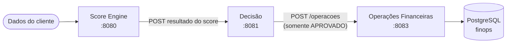
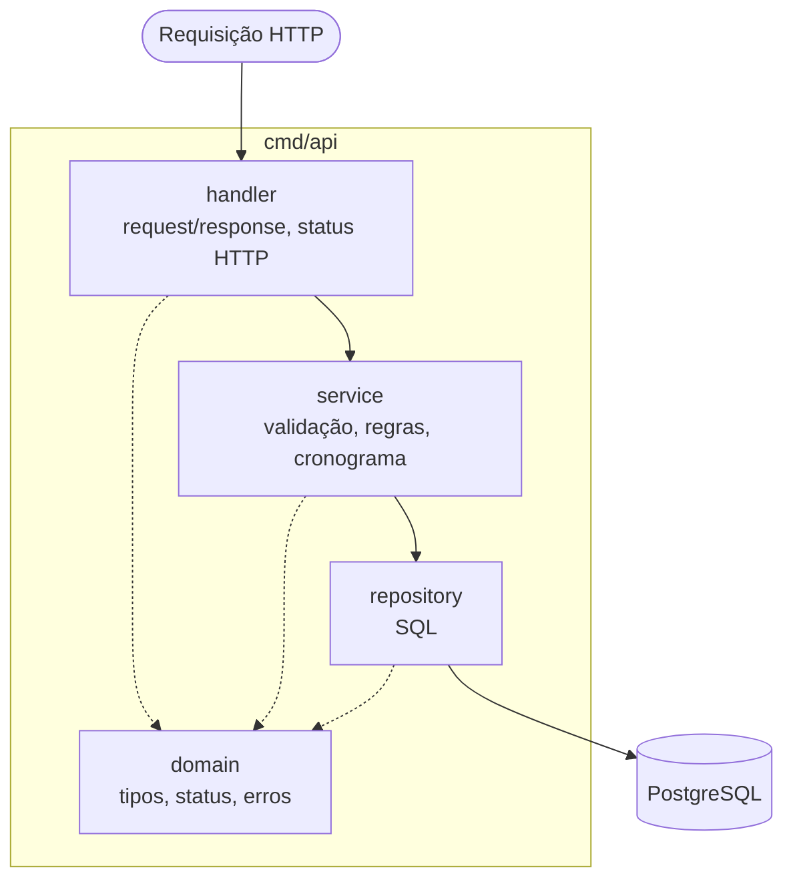
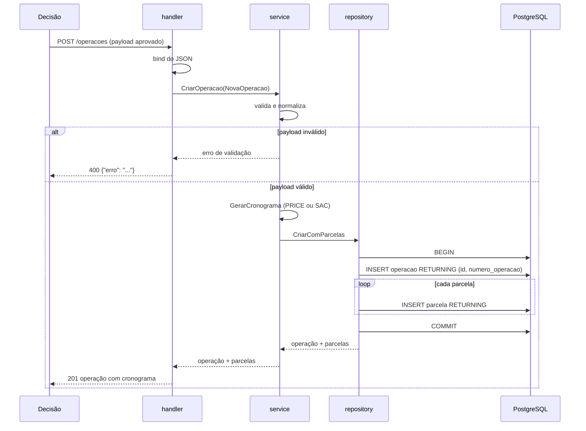
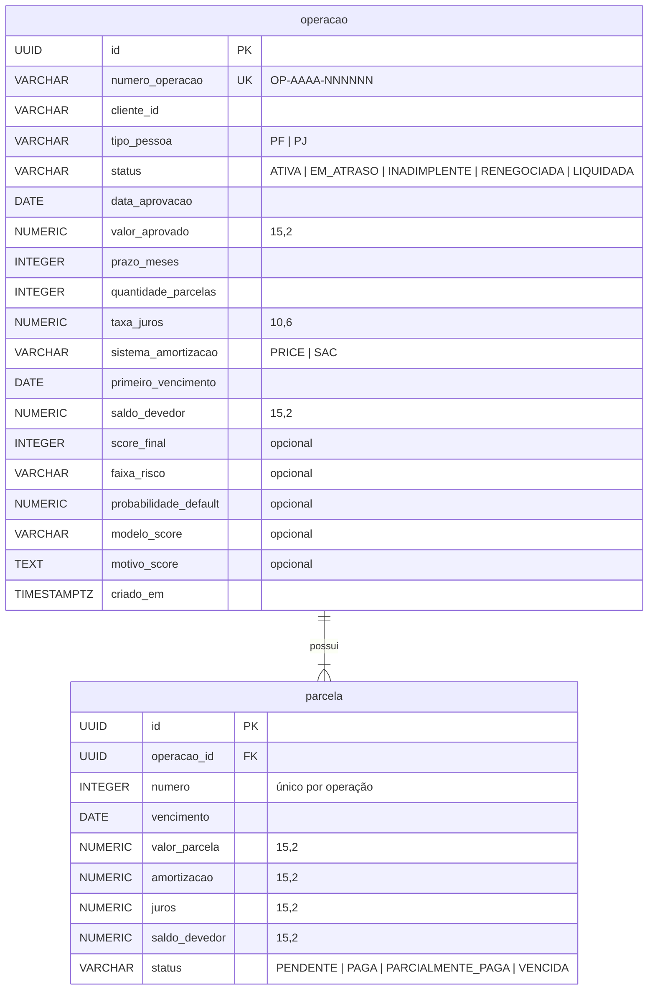
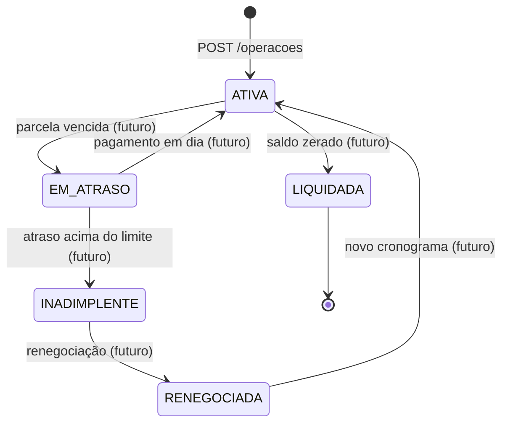

# Diagramas

Os diagramas estão em [Mermaid](https://mermaid.js.org/), que o GitHub renderiza direto no navegador.

## Contexto: Esteira de Crédito

Este serviço é a última etapa: recebe apenas operações aprovadas e passa a ser dono do ciclo financeiro delas.

## Camadas internas

Detalhes em [ADR-002](../adr/ADR-002-arquitetura-em-camadas.md).

## Fluxo de `POST /operacoes`

## Modelo de dados

Schema completo em [`migrations/`](../../../migrations).

## Ciclo de vida da operação

Na Fase 1 só existe a transição inicial para `ATIVA`. As demais são planejadas; as regras exatas de cada transição serão definidas nas próximas fases.
